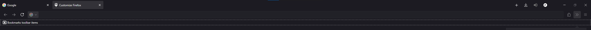

# FirefoxCSSMinimal

Minimal userChrome.css for Firefox.

## Toolbar Customization

First customize your toolbar to match the layout below:

## Installation
Now install the CSS
1. Go to your Firefox profile folder.  
    (Type `about:profiles` in the address bar and click "Open Folder" next to "Profile Folder".)
2. Create a `chrome` folder if it doesn't exist.
3. Copy `userChrome.css` into the `chrome` folder.
4. In Firefox, go to `about:config` and set `toolkit.legacyUserProfileCustomizations.stylesheets` to `true`.
5. Restart Firefox.